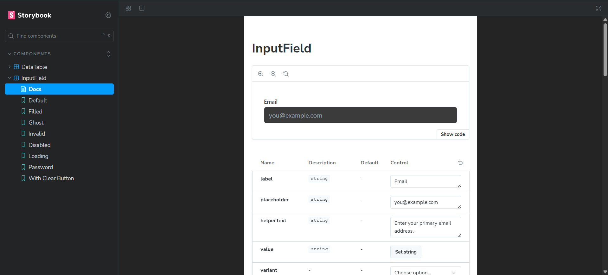
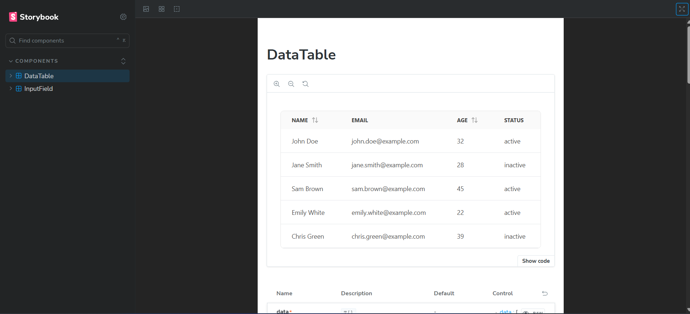
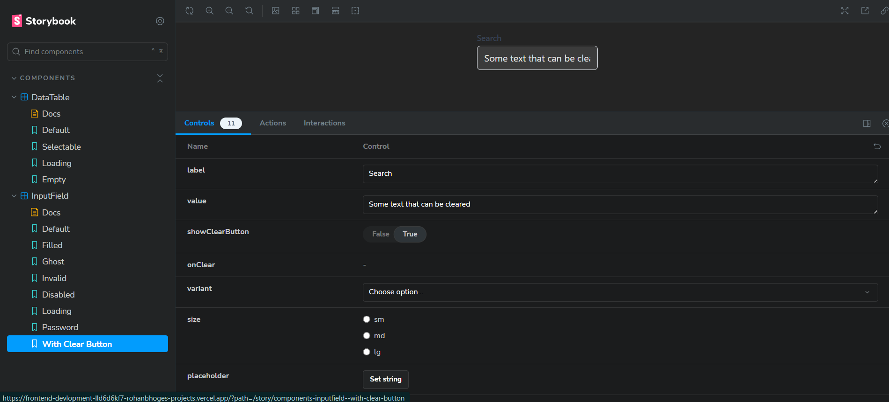

# React Component Library

A professional, production-ready component library built with React, TypeScript, and Tailwind CSS. This project features two core components, an `InputField` and a `DataTable`, documented and tested using Storybook.

### Live Preview

**[View the deployed Storybook on Vercel](https://frontend-devlopment-khaki.vercel.app/?path=/story/components-inputfield--with-clear-button)**

---

## Components Showcase

### 1. InputField

A flexible and robust text input component with built-in states, variants, and accessibility features.

<!-- Screenshot of InputField Docs -->
<!-- Drag and drop your InputField screenshot here -->


**Features:**
- **States:** Supports `default`, `disabled`, `invalid`, and `loading` states.
- **Variants:** Comes in `outlined`, `filled`, and `ghost` styles.
- **Sizes:** Available in `sm`, `md`, and `lg` sizes.
- **Floating Label:** Includes an animated floating label for a modern UX (for `outlined` and `filled` variants).
- **Optional Add-ons:** Built-in support for a password visibility toggle and a clear button.
- **Accessibility:** ARIA attributes and `label`-`input` connections are handled automatically.

### 2. DataTable

A performant and feature-rich data table for displaying tabular data.

<!-- Screenshot of DataTable Showcase -->
<!-- Drag and drop your DataTable screenshot here -->


**Features:**
- **Generic & Type-Safe:** Built with TypeScript generics (`<T>`) to work with any data structure.
- **Column Sorting:** Supports ascending and descending sorting on any specified column.
- **Row Selection:** Enable checkboxes for single or multiple row selection.
- **Loading State:** Displays a clean skeleton loader while data is being fetched.
- **Empty State:** Shows a user-friendly message when no data is available.
- **Responsive:** The table becomes horizontally scrollable on smaller screens to prevent layout breaking.

---

### Interactive Controls with Storybook (GIF)

This library is documented using Storybook, which provides an interactive workshop for viewing components in isolation and testing their props in real-time.

<!-- (Optional) Interactive GIF -->
<!-- Drag and drop your interactive GIF here -->


---

## Tech Stack

- **Framework:** React 19
- **Language:** TypeScript
- **Styling:** Tailwind CSS with `cva` for variant management
- **Build Tool:** Vite
- **Documentation & Testing:** Storybook

---

## Local Setup Instructions

To run this project on your local machine, follow these steps:

1.  **Clone the repository:**
    ```bash
    git clone [https://github.com/RohanBhoge/front-end-dev-rohan](https://github.com/RohanBhoge/front-end-dev-rohanp)
    cd front-end-dev-rohan
    ```

2.  **Install dependencies:**
    ```bash
    npm install
    ```

3.  **Run Storybook:**
    This will start the development server and open the Storybook interface in your browser, typically at `http://localhost:6006`.
    ```bash
    npm run storybook
    ```

---

## Development Approach

This project was built following modern best practices for component development:

- **Atomic Design:** Components are designed to be self-contained, reusable, and composable.
- **Developer Experience (DX):** The component APIs are strictly typed with TypeScript and thoroughly documented in Storybook, making them easy and predictable to use.
- **User Experience (UX):** All components are fully responsive, accessible (A11y), and provide clear visual feedback for all interactive states.
- **Styling with `cva`:** The `class-variance-authority` library is used to manage complex styling variants in a clean, type-safe, and scalable way, keeping styling logic separate from component logic.
